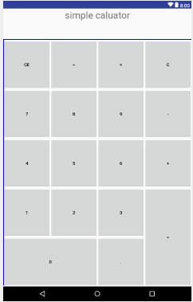

## My first calculator app

### table view


I used three layout to make this view beautiful

```xml
<TextView>
<HorizontalScrollView>
<LinearLayout>
```

which correspond to the title, answer text and button list

in `<LinearLayout>` view, I also divided this view in two partsthe left three column and right one column, because the symbol `=` are two lines

at right layout, divided into five lines, there are two or three buttons at each line; at left layout, add four buttons

### main function

function prototype:

```
void click_clear(View v);
void click_cancer(View v);
void click_operator(View v);
void click_dot(View v);
void click_operator_equal(View v);
void click_num(View v);
// the function call when click buttons

boolean delete_0();
// delete the 0 in the front of number (like 01 * 2)

char getLastDigit(String text)

LinkedList<String> seperate(String equation);
// transfer the string type equation to LinkedList<String> type equation

LinkedList<String> transferToSuffix(LinkedList<String> list);
// transfer the infix expression to suffix expression

double calculate(LinkedList<String> suffix);
// calculate answer with suffix expression

String simplify(double answer);
// delete the 0 or dot(.) behind answer(avoid 1.00000) 

boolean isOperator(String oper);

int priority(String s);
// return the priority of an operator 

double cal(double num1, double num2, String operator);
// reutrn num1 operator(+, -, *, /) num2

```


